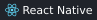
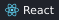

<h1 align="center">Hi, I'm Eunhwa 👋</h1>

<b>Signal processing · VIO localization · Mobile & wearable systems</b> M.S. student at Chung-Ang University · <a href="https://hcslab.cau.ac.kr/">HCSLAB</a>

I turn sensing ideas into working systems — from **signal analysis and localization** to **physical prototypes and connected devices**.

### 🔬 Selected research

| Project | Research focus |
| :--- | :--- |
| **Smartphone heart-sound sensing** | Smartphone-based heart-sound acquisition and analysis, combining signal processing with mobile sensing prototypes. |
| **Mobile localization** | Mobile position tracking using camera and motion-sensor data, with a focus on measurement consistency. |
| **Wearable data collection** | Sensor-data collection across mobile and wearable devices, focusing on connectivity, time alignment, and coordinated recording. |

### 🧰 Tech stack

**Languages:** &nbsp;           

**AI & Signal:** &nbsp;       

**Mobile:** &nbsp;       

**Web & Desktop:** &nbsp;    

**Backend:** &nbsp;    

**Data & Cloud:** &nbsp;     

**Tools & Build:** &nbsp;    

**3D Printing:** &nbsp;  

### 🛠 Selected projects & code

| Project | What I worked on |
| :--- | :--- |
| **[Wakie-Talkie](https://github.com/Ontheway-01/Wakie-Talkie)** | Planning, Swift app, Django backend, XTTS-v2 selection and GPU inference; speech endpoint detection and playback |
| **[CoolCoolCoffee](https://github.com/Ontheway-01/CoolCoolCoffee)** | Planning, literature review, Flutter development, OCR parsing and menu matching |
| **[CAUSW](https://github.com/Ontheway-01/CAUSW_frontend_V2)** | Next.js / React contributions to posts, comments, voting, and API-driven UI state |
| **[Welcome-git](https://github.com/Ontheway-01/Welcome-git)** | C# desktop Git client; branch management, commit history, and process output handling |
| **[느릿 · Neurit](https://github.com/Ontheway-01/neurit-travel)** | Personal iOS travel journal with location, photos, and receipt OCR; AI-assisted MVP development |

### 📄 Selected publication

**Enabling Ubiquitous High-Fidelity Cardiac Auscultation via Integration of Smartphone and 3D Printing Technologies** 
**Eunhwa Lee**, Joonhee Lee, Siyun Lee, Junhyub Lee, Si-Hyuck Kang, Hyosu Kim. 
*UIST Adjunct 2025 · Poster · First author* · [Paper](https://doi.org/10.1145/3746058.3758386)

### 🎓 Education & research experience

- **2024.09 – 2027.02 (expected)** · M.S., Computer Science and Engineering, Chung-Ang University · HCSLAB
- **Summer 2023 – 2024.08** · Undergraduate researcher, HCSLAB, Chung-Ang University
- **2020.03 – 2024.08** · B.Eng., School of Software, Chung-Ang University · Early graduation

### 🏅 Scholarships & team awards

- **National Excellence Scholarship (Science & Engineering)** · Undergraduate tuition
- **GRS Scholarship** · Graduate tuition
- **2024 CAU Engineering Academic Festival** · Software College Dean’s Award · Wakie-Talkie
- **2024 ALCP** · Outstanding Team · Wakie-Talkie

### 🌱 Beyond the code

🧗 Climbing · 🏐 Volleyball · 🏹 Korean traditional archery
