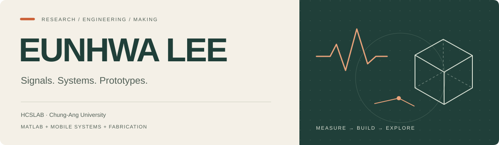

<b>이은화 · Eunhwa Lee</b> &nbsp; / &nbsp; M.S. student, Chung-Ang University · HCSLAB

I connect **signal processing, mobile systems, and physical prototyping**. My research spans acoustic sensing, VIO-based localization, and communication between wearable devices.

[Portfolio](https://github.com/Ontheway-01/portfolio) · [HCSLAB](https://hcslab.cau.ac.kr/) · [Email](mailto:eunhwa813@cau.ac.kr)

## 01 / Research

**[Smartphone heart-sound sensing](https://github.com/Ontheway-01/portfolio/blob/main/projects/cardio.md)** 
Smartphone-based heart-sound acquisition and analysis, combining signal processing with mobile sensing prototypes.

**Mobile localization** 
Mobile position tracking using camera and motion-sensor data, with a focus on measurement consistency.

**Wearable data collection** 
Sensor-data collection across mobile and wearable devices, focusing on connectivity, time alignment, and coordinated recording.

## 02 / How I build

**ANALYZE** &nbsp; MATLAB · Python 
Signal analysis, processing, and evaluation.

**FABRICATE** &nbsp; Fusion · Bambu Lab 
3D modeling and printing for physical sensing prototypes.

**IMPLEMENT** &nbsp; Kotlin · Swift · Flutter · C# · TypeScript 
Mobile / wearable systems and application interfaces. Django, React / Next.js, Firebase, and Supabase.

## 03 / Research journey

**2024.09 — Present** 
M.S. student · Computer Science and Engineering, Chung-Ang University · HCSLAB

**Summer 2023 — 2024.08** 
Undergraduate researcher · HCSLAB, Chung-Ang University

**2020.03 — 2024.08** 
B.S. · Computer Science and Engineering, Chung-Ang University · Early graduation

National Excellence Scholarship (Science & Engineering), undergraduate studies · GRS Scholarship, graduate studies.

## 04 / Selected publication

**Enabling Ubiquitous High-Fidelity Cardiac Auscultation via Integration of Smartphone and 3D Printing Technologies** 
**Eunhwa Lee**, Joonhee Lee, Siyun Lee, Junhyub Lee, Si-Hyuck Kang, Hyosu Kim. 
*UIST Adjunct 2025 · Poster · First author* · [Paper](https://doi.org/10.1145/3746058.3758386)

## 05 / More things I've built

- **[Wakie-Talkie](https://github.com/Ontheway-01/portfolio/blob/main/projects/wakie-talkie.md)** — Swift · Django · STT / dialogue / TTS
- **[CoolCoolCoffee](https://github.com/Ontheway-01/portfolio/blob/main/projects/coolcoolcoffee.md)** — Flutter · OCR-to-menu matching · caffeine/sleep features
- **[CAUSW](https://github.com/Ontheway-01/portfolio/blob/main/projects/causw.md)** — Next.js · posts, comments, and voting flows
- **[Welcome-git](https://github.com/Ontheway-01/portfolio/blob/main/projects/welcome-git.md)** — C# · Git GUI · branch management and commit history
- **[느릿 · Neurit](https://github.com/Ontheway-01/portfolio/blob/main/projects/neurit.md)** — Personal iOS travel journal · AI-assisted development

---

Off the screen — climbing, volleyball, and Korean traditional archery.
